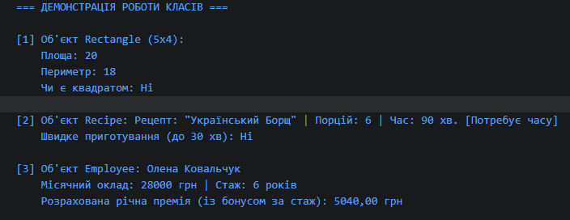

## Контрольні запитання

# 1 Які мінімальні елементи повинен містити клас у цьому завданні?

Мінімум 2 приватних поля (private).

Публічну властивість (public) з get / set (або read-only).

Конструктор із параметрами для ініціалізації полів.

Щонайменше 1 метод із логікою обчислення або перевірки стану.

# 2 Чому поля доцільно робити приватними, а доступ до них надавати через властивості?

Це забезпечує інкапсуляцію (захист даних). Приватні поля захищені від випадкової або некоректної зміни ззовні, а властивості дозволяють контролювати доступ, валідувати вхідні значення та обмежувати модифікацію (наприклад, робити властивості read-only).

# 3 Для чого в класі потрібен конструктор і як він пов’язаний зі станом об’єкта?

Конструктор відповідає за створення екземпляра класу та початкову ініціалізацію його полів. Він визначає початковий стан об’єкта та гарантує, що об'єкт одразу створюється в коректному і готовому до використання вигляді.

# 4 Як у Main показати, що методи класу працюють коректно?

Для кожного класу створюється об’єкт із тестовими значеннями через конструктор, викликаються його методи, а отримані результати виводяться в консоль за допомогою Console.WriteLine().
