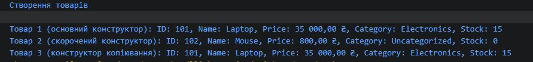

1. Навіщо потрібне перевантаження конструкторів у класі Product?

Щоб створювати об'єкти з різним рівнем деталізації даних (наприклад, тільки назва з ціною або всі 5 параметрів), роблячи клас гнучким.

2. Чому конструктор копіювання зручно реалізовувати через this(...)?

Це усуває дублювання коду (принцип DRY) — конструктор копіювання передає значення в основний конструктор, де зібрана вся логіка ініціалізації.

3. Які переваги дає read-only доступ до властивостей після створення об’єкта?

Забезпечує імутабельність (незмінність) об’єкта, захищаючи його дані від випадкових або некоректних змін ззовні.

4. У яких випадках перевизначення ToString() спрощує налагодження та демонстрацію роботи класу?

Дозволяє зручно виводити об'єкт у консоль через Console.WriteLine(product) та одразу бачити його стан під час дебагу.

