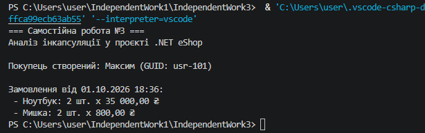

1. За якими ознаками можна зробити висновок, що в класі дотримано інкапсуляції?

Поля є приватними (private), доступ регулюється властивостями (часто read-only або private set), а внутрішні колекції не модифікуються напряму ззовні.

2. Які підходи до валідації властивостей ви зустріли в реальному коді?

Перевірка за допомогою if із викиданням винятків (ArgumentNullException, ArgumentException) та захисні методи замість відкритих сеттерів.

3. Чому для аналізу важливо наводити посилання на конкретні класи та фрагменти коду?

Це дозволяє підтвердити актуальність досліджуваного коду та полегшує перевірку реалізації ООП у реальному середовищі.

4. Які висновки щодо якості проєктування ви зробили після порівняння 2-3 класів?

Якісна архітектура мінімізує використання публічних сеттерів, забезпечуючи коректний стан об'єкта від моменту його створення.
